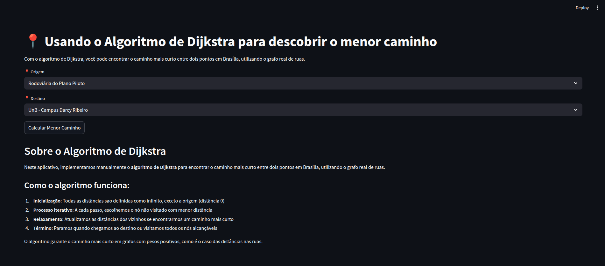
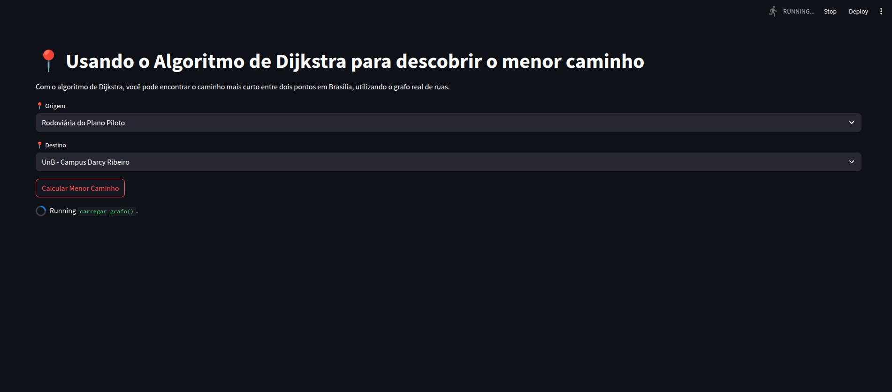

# 99Grafos

**Número da Lista**: 2<br>
**Conteúdo da Disciplina**: Grafos 2<br>

## Alunos
|Matrícula | Aluno |
| -- | -- |
| 22/2021890  | Manuella Magalhães Valadares |
| 22/2021906 |  Marcos Vieira Marinho |

## Sobre 
Desenvolvemos o 99Grafos, uma aplicação web que calcula o caminho mais curto entre pontos importantes de Brasília usando o algoritmo de Dijkstra em um grafo real de ruas. A aplicação simula um serviço de transporte que calcula rotas otimizadas e fornece estimativas de custo para viagens.

## Vídeo de Apresentação

[Link da Apresentação](https://youtu.be/isPKNwE7H34)


## Screenshots





## Instalação 
**Linguagem**: Python<br>
**Framework**: Streamlit<br>

### Pré-requisitos
Certifique-se de ter o Python 3.7 ou superior instalado em sua máquina. Além disso, instale as seguintes bibliotecas necessárias para o projeto:

```bash
pip install streamlit networkx pandas pydeck geopy osmnx
```

### Comandos para execução
1. Clone o repositório para sua máquina local:
2. Navegue até o diretório do projeto:
3. Execute o aplicativo Streamlit:
    ```bash
    streamlit run main.py
    ```
4. Acesse o aplicativo no navegador através do endereço exibido no terminal (geralmente `http://localhost:8501`).


## Uso

A interface do aplicativo foi projetada para ser simples e intuitiva. O usuário encontrará dois campos principais: "Origem" e "Destino". Basta selecionar os locais desejados em cada campo e clicar no botão "Calcular Menor Caminho". O sistema processará a solicitação e exibirá o trajeto otimizado no mapa. Para realizar uma nova busca, basta repetir o processo.
